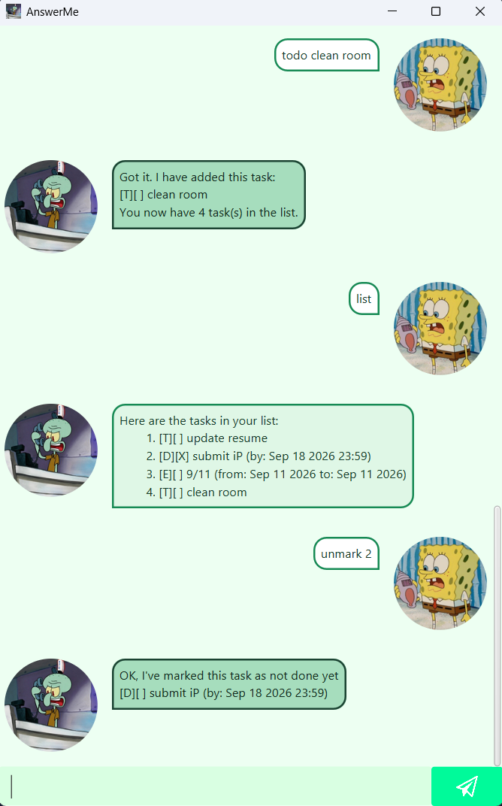

# AnswerMe User Guide



**AnswerMe** is an interactive task management application. It frees your mind from having to remember countless things that you need to get done.

## Getting Started
1. Ensure you have [Java 25](https://www.oracle.com/java/technologies/downloads/#java25) installed on your computer.
2. Download the [latest release](https://github.com/RyanNgCT/ip/releases) of AnswerMe as a `.jar` file.
3. Place the `.jar` file in a directory of your choosing.
4. Open a new terminal window in that folder and run:
```
java -jar answerme.jar
```
5. This should open the graphical window, as shown above for you to enter commands.
6. Hit the submit button (i.e. the plane icon) or press `Enter` to send a command to AnswerMe.

## Command Summary

| Command | Command Syntax | Purpose |
| --- | --- | --- |
| `todo` | `todo <task-description>` | Adds a todo task. |
| `deadline` | `deadline <task-description> /by <when>` | Adds a task with a due date and/or time. |
| `event` | `event <task-description> /from <when> /to <when>` | Adds an event with a start and end date and/or time. |
| `list` | `list` | Displays all saved tasks. |
| `delete` | `delete <task-index>` | Removes a task from the list. |
| `find` | `find <search-term>` | Searches for tasks matching a search term. |
| `mark` | `mark <task-index>` | Marks a task as completed. |
| `unmark` | `unmark <task-index>` | Marks a task as incomplete. |
| `dedup` | `dedup` | Removes saved duplicate tasks. |
| `bye` | `bye` | Exits the application. |

## Adding Tasks
### Add To-dos with `todo`
Adds a new To-do, a task without a deadline.

#### Usage: `todo <task-description>`

#### Examples
- `todo update resume`
- `todo clean room`

#### Expected Output
```
Got it. I have added this task:
[T][ ] update resume
You now have 1 task(s) in the list.
```

### Add Deadlines with `deadline`

Adds a new deadline with its associated due date.

#### Usage: `deadline <task-description> /by <when>`

#### Examples
- `deadline submit iP /by 18/9/2026 23:59`
- `deadline complete Week 6 tutorial /by 17/9/2026`
- `deadline submit quiz answers /by 20/9/2026 12:00`

#### Expected Output
```
Got it. I have added this task:
[D][ ] submit iP (by: Sep 18 2026 23:59)
You now have 2 task(s) in the list.
```

### Add Events with `event`
Adds a new event with a start and end date/time.

#### Usage: `event <task-description> /from <when> /to <when>`

#### Examples
- `event CS2103 tutorial /from 17/9/2026 13:00 /to 17/9/2026 14:00`
- `event 9/11 /from 11/9/2026 /to 11/9/2026`

#### Expected Output
```
Got it. I have added this task:
[E][ ] 9/11 (from: Sep 11 2026 to: Sep 11 2026)
You now have 3 task(s) in the list.
```

### Accepted date and datetime formats
The following formats can be used for populating `<when>` in the deadline and event commands. When a time is omitted, the time defaults to midnight and only the date is displayed.

| Acceptable date format | Acceptable datetime format |
| --- | --- |
| `yyyy-M-d` (e.g., `2026-9-18`) | `yyyy-M-d HH:mm` (e.g., `2026-9-18 23:59`) |
| `yyyy/M/d` (e.g., `2026/9/18`) | `yyyy/M/d HH:mm` (e.g., `2026/9/18 23:59`) |
| `d-M-yyyy` (e.g., `18-9-2026`) | `d-M-yyyy HHmm` or `d-M-yyyy HH:mm` (e.g., `18-9-2026 2359` or `18-9-2026 23:59`) |
| `d/M/yyyy` (e.g., `18/9/2026`) | `d/M/yyyy HHmm` or `d/M/yyyy HH:mm` (e.g., `18/9/2026 2359` or `18/9/2026 23:59`) |
| `MMM d yyyy` (e.g., `Sep 18 2026`) | `MMM d yyyy HH:mm` (e.g., `Sep 18 2026 23:59`) |


## Viewing tasks with `list`
Displays the current list of tasks.

### Usage: `list`

### Expected Output
**Case 1:** Some tasks were created and they can be displayed.
```
Here are the tasks in your list:
    1. [T][ ] update resume
    2. [D][ ] submit iP (by: Sep 18 2026 23:59)
    3. [E][ ] 9/11 (from: Sep 11 2026 to: Sep 11 2026)
```

**Case 2:** The current list does not contain any tasks.
```
Task list is empty!
```

## Removing a task with `delete`
Removes the task based on its index reflected in `list`.

### Usage: `delete <task-index>`
- Note that indexing starts from one, following those in the `list` command.

### Examples
- `delete 2`
- `delete 3`

### Expected Output
**Case 1:** The task at the specified index exists and is removed.
```
Noted. I will remove this task:
[E][ ] 9/11 (from: Sep 11 2026 to: Sep 11 2026)
You now have 2 task(s) in the list.
```

**Case 2:** The task at the specified index does not exist (i.e. no removal performed).
```
Oh no! The task does not exist in the list.
```

## Search for tasks with `find`
Displays tasks whose descriptions contain the given search term. The search term is **case-insensitive**.

### Usage: `find <search-term>`

### Examples
- `find submit`
- `find iP`

### Expected Output
**Case 1:** Some tasks containing the task description were found.
```
Here are the matching tasks in your list:
    1. [D][ ] submit iP (by: Sep 18 2026 23:59)
    2. [D][ ] submit quiz answers (by: Sep 20 2026 12:00)
```

**Case 2:** No matching tasks were found for the given task description.
```
No tasks matching "abc" were found
```

## Managing Task Statuses
### Indicate task completion with `mark`
Marks a task as completed, based on its index reflected in `list`.

#### Usage: `mark <task-index>`

#### Examples
- `mark 1`
- `mark 2`

#### Expected Output
```
Nice! I have marked this task as done:
[D][X] submit iP (by: Sep 18 2026 23:59)
```

### Indicate an incomplete task with `unmark`
Marks a task as not complete, based on its index reflected in `list`.

#### Usage: `unmark <task-index>`

#### Examples
- `unmark 1`
- `unmark 2`

#### Expected Output
```
OK, I've marked this task as not done yet
[T][ ] update resume
```

## Remove duplicate tasks using `dedup`
Removes duplicate saved tasks from the task list. Tasks are considered duplicates when they have the same task type and description, ignoring differences in case.

The implementation preserves the first occurrence in the current task list, regardless of its date, time, or completion status.

This command is useful in removing duplicates already present in saved data.

### Usage: `dedup`

### Expected Output
**Case 1:** Duplicate entries are found and removed.
```
Removed the following duplicate task(s):
    1. [T][X] update RESUME
You now have 3 task(s) in the list.
```

**Case 2:** No duplicate entries are found, so no action is taken.
```
No duplicate tasks found.
```

## Exiting AnswerMe with `bye`
Terminates the chatbot session.

### Usage: `bye`

### Expected Output
```
Bye. Hope to see you again soon!
```

The application then exits.

---
## Some pointers worth noting
- Your tasks are saved in `data/tasks.txt` to ensure persistence of data across sessions.
- The application considers tasks with the same type and same description as _duplicates_. You will not be able to add tasks that are duplicates!
- You are not allowed to use pipe characters (`|`) in task descriptions.